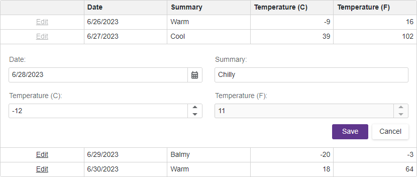

<!-- default badges list -->

[](https://supportcenter.devexpress.com/ticket/details/T1106833)
[](https://docs.devexpress.com/GeneralInformation/403183)
<!-- default badges end -->
# Grid for Blazor - Restrict data editing to rows that match specific conditions

This example disables our Blazor Grid’s **Edit** button whenever the Date field value is less than or equal to the current date.



## Overview

Follow the steps below to enable row editing for field values that match a specific condition.

### 1. Create a custom Edit button

Declare the [DxGridCommandColumn](https://docs.devexpress.com/Blazor/DevExpress.Blazor.DxGridCommandColumn) object in the [Columns](https://docs.devexpress.com/Blazor/DevExpress.Blazor.DxGrid.Columns) template to display a command column. The command column displays predefined **New**, **Edit**, and **Delete** command buttons. Define the column's [cell display template](https://docs.devexpress.com/Blazor/DevExpress.Blazor.DxGridCommandColumn.CellDisplayTemplate) to implement a custom **Edit** [button](https://docs.devexpress.com/Blazor/401581/buttons). 

```razor
<DxGrid @ref="myGrid" Data="@forecasts">
    <Columns>
        <DxGridCommandColumn NewButtonVisible=false>
            <CellDisplayTemplate>
                <DxButton Text="Edit"/>
            </CellDisplayTemplate>
        </DxGridCommandColumn>
    </Columns>
</DxGrid>
```

### 2. Customize Edit button behaviour

Use the [cell display template](https://docs.devexpress.com/Blazor/DevExpress.Blazor.DxGridCommandColumn.CellDisplayTemplate)'s [context](https://docs.devexpress.com/Blazor/DevExpress.Blazor.GridColumnCellDisplayTemplateContext) parameter to access the [grid object](https://docs.devexpress.com/Blazor/DevExpress.Blazor.GridColumnCellDisplayTemplateContext.Grid) and the processed [data item](https://docs.devexpress.com/Blazor/DevExpress.Blazor.GridColumnCellDisplayTemplateContext.DataItem). Set the **Edit** button's [Enabled](https://docs.devexpress.com/Blazor/DevExpress.Blazor.DxButton.Enabled) property to `true` or `false` based on the data item's field values. Call the grid's [StartEditDataItemAsync](https://docs.devexpress.com/Blazor/DevExpress.Blazor.DxGrid.StartEditDataItemAsync(System.Object)) method to display an edit form when a user [clicks](https://docs.devexpress.com/Blazor/DevExpress.Blazor.DxButton.Click) the **Edit** button.

```razor
<CellDisplayTemplate>
    @{
        var date = context.DataItem != null ? (context.DataItem as WeatherForecast).Date : DateTime.Now;
            <DxButton Text="Edit"
                      Click="() => myGrid.StartEditDataItemAsync(context.DataItem)" 
                      Enabled="@(date <= DateTime.Now)" />
    }
</CellDisplayTemplate>
```

### 3. Define edit form template

The default edit form displays predefined **Save** and **Cancel** buttons. Use the [edit form template](https://docs.devexpress.com/Blazor/DevExpress.Blazor.DxGrid.EditFormTemplate) to define the edit form's content. This example uses our Blazor [DxFormLayout](https://docs.devexpress.com/Blazor/DevExpress.Blazor.DxFormLayout) to display automatically generated editors in the edit form for all editable data columns.

```razor
<EditFormTemplate Context="editFormContext">
    <DxFormLayout>
        <DxFormLayoutItem Caption="Date:">
            @editFormContext.GetEditor("Date")
        </DxFormLayoutItem>
        <DxFormLayoutItem Caption="Summary:">
            @editFormContext.GetEditor("Summary")
        </DxFormLayoutItem>
        <DxFormLayoutItem Caption="Temperature (C):">
            @editFormContext.GetEditor("TemperatureC")
        </DxFormLayoutItem>
        <DxFormLayoutItem Caption="Temperature (F):">
            @editFormContext.GetEditor("TemperatureF")
        </DxFormLayoutItem>
    </DxFormLayout>
</EditFormTemplate>
```

### 4. Save changes and reload data

The [EditModelSaving](https://docs.devexpress.com/Blazor/DevExpress.Blazor.DxGrid.EditModelSaving) event fires when a user submits an edit form and allows you to save changes. Use the following event argument properties to post changes to the data source:

- The [EditModel](https://docs.devexpress.com/Blazor/DevExpress.Blazor.GridEditModelSavingEventArgs.EditModel) property returns the edit model that stores all changes.
- The [DataItem](https://docs.devexpress.com/Blazor/DevExpress.Blazor.GridEditModelSavingEventArgs.DataItem) property returns the proccesed data item.
- The [CopyChangesToDataItem](https://docs.devexpress.com/Blazor/DevExpress.Blazor.GridEditModelSavingEventArgs.CopyChangesToDataItem) method copies all changes made in the edit model to the data item. 

The Blazor Grid automatically [reloads](https://docs.devexpress.com/Blazor/DevExpress.Blazor.DxGrid.Reload) its data after you post updates to the data source.

```razor
<DxGrid @ref="myGrid" Data="@forecasts" EditModelSaving="OnEditModelSaving">
    <!-- ... -->
</DxGrid>

@code {
    void OnEditModelSaving(GridEditModelSavingEventArgs e) {
        e.CopyChangesToDataItem();
    }
}
```

## Files to Review

- [Index.razor](./CS/DisableEditButton/Pages/Index.razor)

## Documentation

- [Grid: Bind to Data](https://docs.devexpress.com/Blazor/403737/grid/bind-to-data)
- [Grid: Edit Data and Validate Input](https://docs.devexpress.com/Blazor/403454/grid/edit-data-and-validate-input)

## More Examples

- [Grid for Blazor - How to edit a row on a separate page](https://github.com/DevExpress-Examples/blazor-DxGrid-Separate-Edit-Form)
- [Grid for Blazor - How to display a custom confirmation dialog](https://github.com/DevExpress-Examples/blazor-dxgrid-show-custom-confirmation-dialog)
